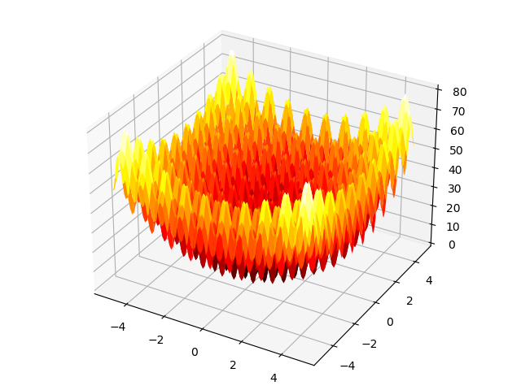
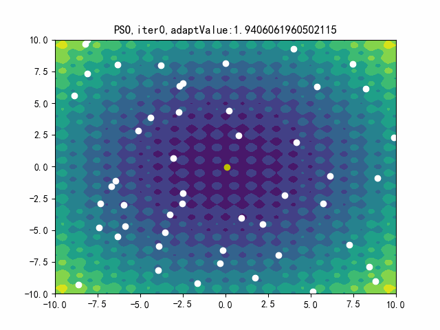
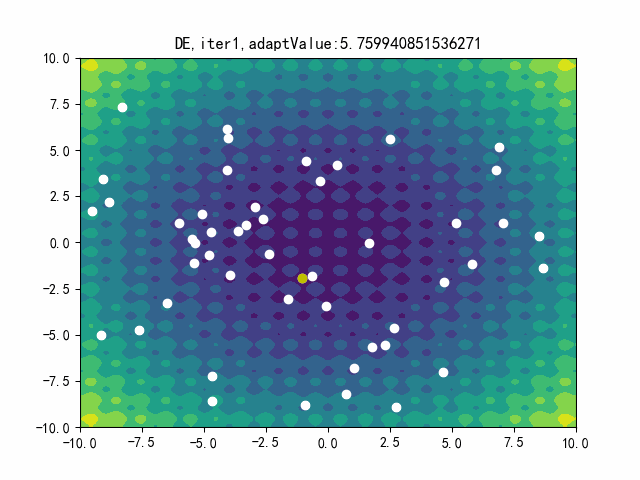
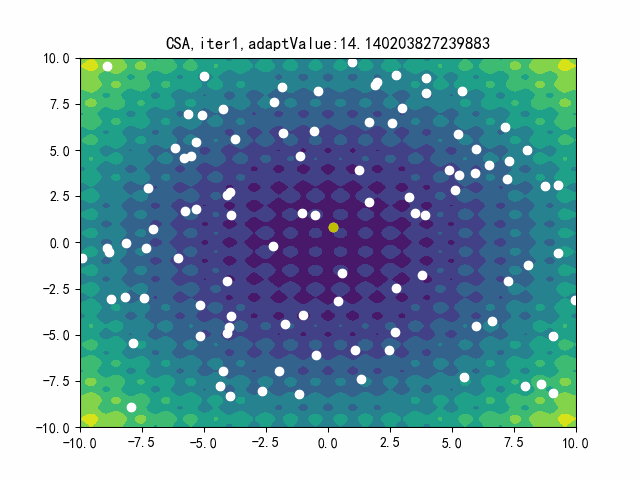
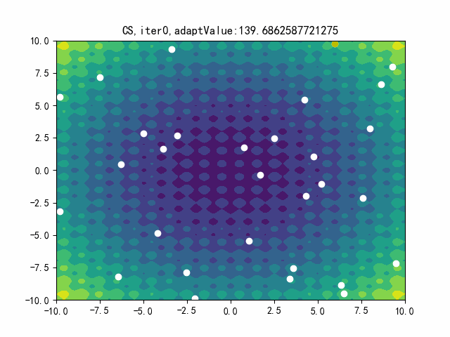
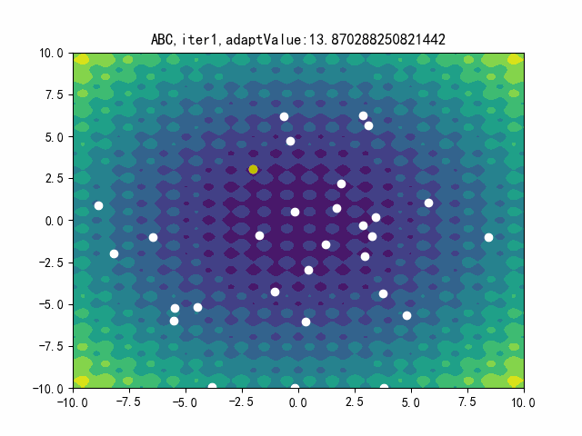

# Computing Intelligent Optimal Algorithm

Include PSO SA CS CSA ABC DE python implement

#### test function: RASTRIGIN

#### PSO（粒子群算法）

#### SA（模拟退火算法）

#### DE（差分进化算法）

#### CSA（克隆选择算法）

#### CS（杜鹃搜索算法/布谷鸟搜索算法）

#### ABC（人工蜂群算法）

